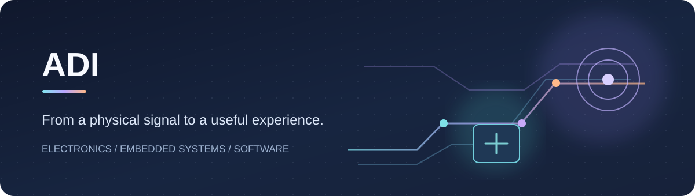
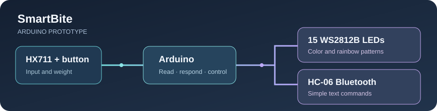

# Hi, I'm Adi 👋

I build prototypes that connect **hardware, software and human experience**.

`Embedded systems` · `FPGA` · `Physical computing` · `Python` · `Android` · `CAD`

[Selected projects](#selected-projects) · [Arduino Tic-Tac-Toe](https://adig741.github.io/arduino-tic-tac-toe-touchscreen/) · [What I enjoy building](#what-i-enjoy-building) · [עברית](#עברית)

## Selected projects

### 💡 BrightNet · communication through light

My final engineering project at Shenkar College explores bidirectional data communication through visible light. A lamp and dongle form an optical link, with FPGA firmware and Windows and Android tools for control and diagnostics.

| Hardware and optics | Digital logic | Software and documentation |
| :--- | :--- | :--- |
| LED transmitter, lens, photodiode receiver and enclosures | DECA MAX 10 and DE0 Cyclone III endpoints, framing and CRC | Windows Universal Console, Android companion app, schematics and validation notes |

[BrightNet project page](https://github.com/adig741/BrightNet-Optical-Network) · [BrightNet Projects page and board](https://github.com/users/adig741/projects/2/views/1?pane=info) · [Full archive 🔒](https://github.com/adig741/BrightNet-Project-Archive) (private; access required)

The private archive holds BrightNet source and final deliverables. Its older drafts and generated files are stored in [seven downloadable archive volumes](https://github.com/adig741/BrightNet-Project-Archive/tree/main/11_Historical_Backup).

  
   BrightNet concept illustration

---

### ⚖️ SmartBite · a responsive scale prototype

An Arduino course prototype that brings together an HX711 weight sensor, a 15 LED WS2812B strip, a button and HC-06 Bluetooth communication. The sketches include weight reading and calibration, light patterns, and simple text commands for controlling color and requesting a reading.

  

`Arduino / C++` · `HX711` · `FastLED` · `Bluetooth` · `WS2812B`

[SmartBite project board 🔒](https://github.com/users/adig741/projects/4/views/1?pane=info) · [Source and coursework archive 🔒](https://github.com/adig741/SmartBite-Product-Development) (both private; access required)

---

### 🎮 Arduino Tic-Tac-Toe · a touchscreen game

An earlier Programming 1 project by Faraj Kharbaoui and me: a two-player Tic-Tac-Toe game on an Arduino Mega 2560 with an Elegoo touch display and buzzer. The sketch handles touch input, turns, win and tie detection, and sound feedback. The project page includes photos, a video, and a playable browser version.

[Explore the project page](https://adig741.github.io/arduino-tic-tac-toe-touchscreen/) · [Source and setup](https://github.com/adig741/arduino-tic-tac-toe-touchscreen)

  

## What I enjoy building

I like following a signal through an entire system: sensing something in the physical world, shaping it with logic and a protocol, and making the result understandable through light or an interface. My work spans experimental hardware, embedded code and the tools needed to test and explain a prototype.

## עברית

אני עדי, ובונה אבטיפוסים שמחברים בין אלקטרוניקה, תוכנה וחוויית משתמש.

**BrightNet** הוא פרויקט הגמר שלי בשנקר: אבטיפוס לתקשורת נתונים דו־כיוונית באמצעות אור נראה, הכולל רכיבי FPGA, תכנון אופטי, תוכנת Windows ואפליקציית Android. [לדף הפרויקט](https://github.com/adig741/BrightNet-Optical-Network) · [לדף Projects והלוח של BrightNet](https://github.com/users/adig741/projects/2/views/1?pane=info) · [לארכיון המלא](https://github.com/adig741/BrightNet-Project-Archive) השמור במאגר פרטי. טיוטות וקבצים שנוצרו במהלך העבודה זמינים בארכיון בשבעה חלקים להורדה.

**SmartBite** הוא אבטיפוס Arduino המשלב חיישן משקל, פס נורות וכפתור עם פקודות Bluetooth. [לוח Projects של SmartBite](https://github.com/users/adig741/projects/4/views/1?pane=info) ו[ארכיון הקוד והחומרים](https://github.com/adig741/SmartBite-Product-Development) שמורים בנפרד, עם גישה פרטית.

בפרויקט מוקדם יותר בניתי עם פרג׳ חרבאוי [משחק איקס עיגול לארדואינו](https://adig741.github.io/arduino-tic-tac-toe-touchscreen/) על מסך מגע, עם צלילים וזיהוי ניצחון. [הקוד והוראות ההתקנה](https://github.com/adig741/arduino-tic-tac-toe-touchscreen) זמינים ב־GitHub.

